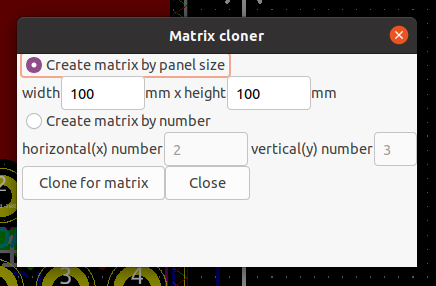

# matrix_cloner

A plugin for KiCad pcbnew to put pcb on matrix for v cut order.



# Usage

## Setup

Put this project to a directory for plugin.

For Windows.
```
mkdir -p ~/AppData/Roaming/kicad/scripting/plugins
cd ~/AppData/Roaming/kicad/scripting/plugins
git clone https://github.com/asukiaaa/matrix_cloner.git
```

For Mac.
```
mkdir -p ~/Library/Preferences/kicad/scripting/plugins
cd ~/Library/Preferences/kicad/scripting/plugins
git clone https://github.com/asukiaaa/matrix_cloner.git
```


For Linux.
```
mkdir -p ~/.kicad/scripting/plugins
cd ~/.kicad/scripting/plugins
git clone https://github.com/asukiaaa/matrix_cloner.git
```

## Run

Then start pcbnew of KiCad and select Tools -> External plugins -> Matrix cloner.

## License

MIT

## References

- [Python Plugin Development for Pcbnew](https://kicad.readthedocs.io/en/latest/Documentation/development/pcbnew-plugins/)
- [KiCad Pcbnew Python Scripting: pcbnew Namespace Reference](https://docs.kicad.org/doxygen-python/namespacepcbnew.html)
- [RadioButton](https://www.python-izm.com/gui/wxpython/wxpython_radiobutton/)
- [wxPython - RadioButton & RadioBox](https://www.tutorialspoint.com/wxpython/wx_radiobutton_radiobox.htm)
- [KiCAD_layout_cloner/layout_cloner.py](https://github.com/tlantela/KiCAD_layout_cloner/blob/master/layout_cloner.py)
